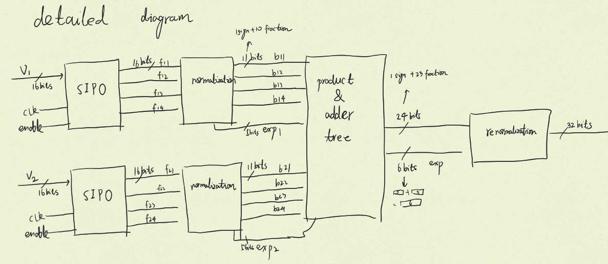
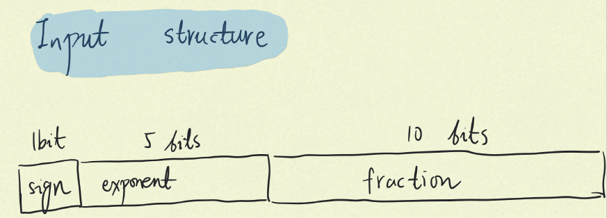
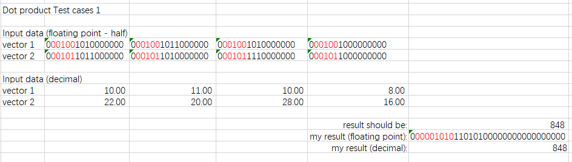
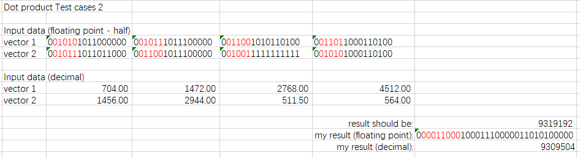
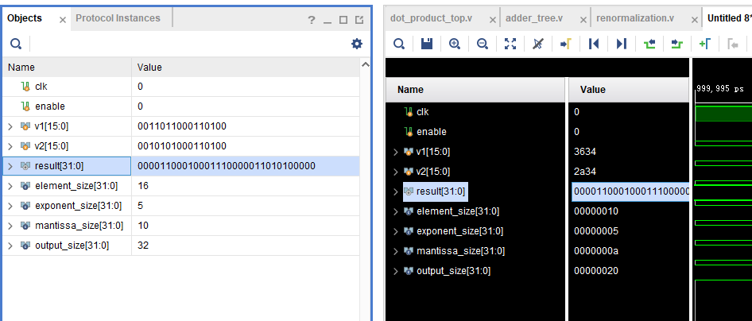

# Customised machine learning inference on FPGAs

This is my ongoing capstone project at USYD

## Background

Machine learning is now widely used in medical, automation, speech recognition, computer vision, etc. It can make predictions or decisions that are difficult to do with traditional algorithms, but it is difficult to be installed in embedded systems due to its high hardware and energy requirements. This project will reduce the amount of computation and energy required for machine learning on FPGAs by changing the underlaying number system (and other methods), so that it can be embedded in systems of various devices.

## Problem statement

The high hardware and energy requirements of machine learning at current stage make it impossible to run in embedded systems.

## Dot product implemented by block floating point

This is the brief explain of the files in the folder "block floating point"

**Block diagram:**

**Tests:**

In test case 2, the result wasn't accurate because some less significant bits were discarded during the normalization step.

